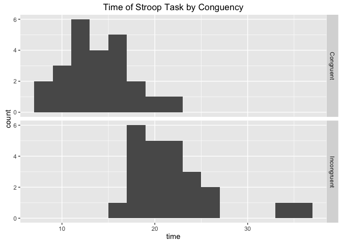
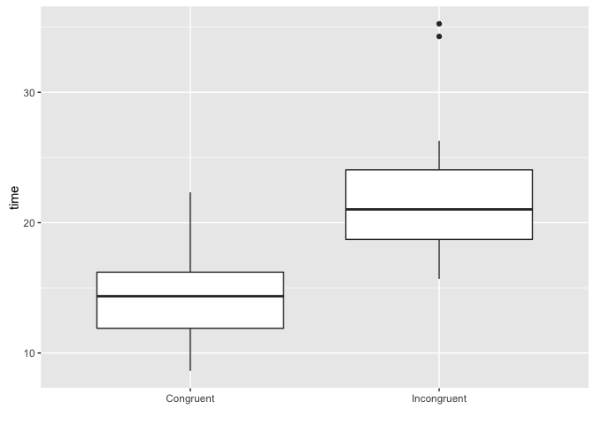

In this experiment we are we are investigating the stroop effect. We will be testing the effect of words being congruent and incongruent with the color they are written in on the length of time that it takes for participants to identify the color that the name of a color is written in.

##### Q1: What is our independent variable? What is our dependent variable?

Our independent variable is if the color is congruent with the word that is written (ex.  red ) or incongruent (ex.  red ).

Our dependent variable is the amount of time it takes to name the colors in the lists.

##### Q2: What is an appropriate set of hypotheses for this task? What kind of statistical test do you expect to perform? Justify your choices.

Our null hypotheses is that a color and the color it is written in matching will have no affect on the average population time to state the color which it is written in. So the population mean time for congruent words is equal to the population mean time for incongruent words.

H0: μcongruent = μincongruent

Our alternate hypothesis is that the color that a color is written in will have an affect on the average population time of how long it takes people to state the color it is written in. So the population mean time for congruent words will not be equal to the population mean time for incongruent words.

H1: μcongruent ≠ μincongruent

Since the participants performed the task both with the words being congruent and incongruent and since time is a continuous variable, we will use a dependent t-test. With there being less than 30 observations we will have it be a two tailed test which have been shown to be accurate for small sample sizes.

##### Q3: Report some descriptive statistics regarding this dataset. Include at least one measure of central tendency and at least one measure of variability.

The congruent times have a mean of `14.05` and a median of `14.36`.

While the incongruent times have a mean of `22.02` and a median of `21.02`.

The congruent times' standard deviation is `3.56`.

The incongruent times' standard deviation is `4.8`.

##### Q4: Provide one or two visualizations that show the distribution of the sample data. Write one or two sentences noting what you observe about the plot or plots.

<!-- -->

When we look at the faceted histogram it looks pretty clear that the stroop task usually takes longer to complete when the coloring is incongruent with the words. At the far right of the "Incongruent" facet we can also see that the incongruency makes the task very difficult for some people.

<!-- -->

In the boxplot we can see more clearly see the distributions and the outliers in incongruent sample. Congruency is still looking like it saves a lot of time.

##### Q5: Now, perform the statistical test and report your results. What is your confidence level and your critical statistic value? Do you reject the null hypothesis or fail to reject it? Come to a conclusion in terms of the experiment task. Did the results match up with your expectations?

Since we are doing a two tailed t-test with alpha = .05 and `23` degrees of freedom our t-critical is +/- 2.069.

For the difference in task time between congruent colors and incongruent colors we get a t-statistic of `-8.03`. Which is well below the -2.069 t-critical value and shows that having congruent colors lowers the time it takes to complete the stroop task a statistically significant amount. So we will reject the null hypothesis.

t(`23`) = `-8.03`, P \< .05

With our confidence interval we can conclude that on average people will take somewhere between `-10.02` and `-5.91` fewer seconds to complete the stroop task when the colors are congruent than when they are incongruent.

##### Q6 (Optional): What do you think is responsible for the effects observed? Can you think of an alternative or similar task that would result in a similar effect? Some research about the problem will be helpful for thinking about these two questions!

It seems that your brain automatically reads the words, even though you are trying to name the color so if they are the same there is no conflict and you can state the color you are thinking when you look at the work. If they are incongruent though, you have both the color you read and the color of the text in your head and you have to sort out which to say which slows you down.

It would be really interesting to see if this carries over to something like having a word super imposed on top of an image and trying to name the image and if having "car" superimposed on a picture of a truck would cause any difference.

##### Resources

I reviewed these concepts further at the following sites:
<http://support.minitab.com/en-us/minitab/17/topic-library/basic-statistics-and-graphs/hypothesis-tests/basics/null-and-alternative-hypotheses/>
<https://statistics.laerd.com/statistical-guides/dependent-t-test-statistical-guide.php>
<http://www.measuringu.com/blog/small-n.php>
